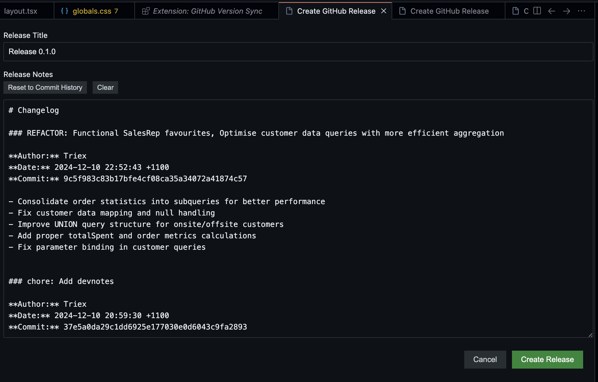

# GitHub Version Sync

[](https://marketplace.visualstudio.com/items?itemName=TriexDev.github-versionsync)
[](https://marketplace.visualstudio.com/items?itemName=TriexDev.github-versionsync)
[](https://marketplace.visualstudio.com/items?itemName=TriexDev.github-versionsync)
[](https://github.com/Triex/github-version-sync/blob/master/LICENSE)

[](https://www.typescriptlang.org/)
[](https://nodejs.org/)
[](https://code.visualstudio.com/api)
[](https://jestjs.io/)
[](https://nextjs.org/)
[](https://tailwindcss.com/)

[](https://github.com/Triex/GitHub-VersionSync/stargazers)
[](https://github.com/Triex/GitHub-VersionSync/issues)
[](https://github.com/Triex/GitHub-VersionSync/commits)
[](https://github.com/Triex/GitHub-VersionSync/releases)
[](https://github.com/Triex/GitHub-VersionSync/commits)

Streamline version management and GitHub releases directly from VS Code / your IDE. Automatically update version numbers, create git tags, and publish GitHub releases with just a few clicks.

📚 **[Documentation & Guides](https://VersionSync.app)** | 💻 [Source Code](https://github.com/Triex/GitHub-VersionSync)

_Note: This extension is currently in alpha and may have bugs or limitations._

<div align="center">
  <table>
    <tr>
      <td align="center" width="50%">
        <br>
        <em>Version control panel with one-click version bumping and GitHub release creation</em>
      </td>
      <td align="center" width="50%">
        <br>
        <em>Create beautiful GitHub releases with auto-generated notes from your commits</em>
      </td>
    </tr>
  </table>
</div>

---

## ✨ Features

### 🔄 Automatic Version Management
- One-click version bumping (patch, minor, major)
- Selectively updates version in `package.json` without affecting other changes
- Follows semantic versioning (SemVer) standards
- Automatically amends commit messages with version information

### 🏷️ Git Integration
- Automatically creates git tags for versions
- Tags are created locally first, with optional remote pushing
- Clean version history with version changes as part of feature commits
- Ensures consistent version management across your project

### 📦 GitHub Release Creation
- Create releases directly from VS Code
- Auto-generates release notes from commits (changelog)
- Fully editable release descriptions
- Supports both automatic and manual releases
- Configure which version types trigger releases
- Supports release assets
- Supports release commands

### 🔧 Robust Commit Handling
- Properly escapes special characters in commit messages (", `, $)
- Reliable changelog generation even with complex Git histories
- Fallback options ensure releases always have useful content

### 🎨 User-Friendly Interface
- Version control buttons in Source Control panel
- Visual feedback for version changes
- Customizable version format in commit messages
- Quick access to settings

---

## 🚀 Getting Started

1. Install the extension from the [VS Code Marketplace](https://marketplace.visualstudio.com/items?itemName=TriexDev.github-versionsync)
2. Open a Git repository with a `package.json` or `VERSION` file
3. Use the Version Control panel in the Source Control section to select version type
4. Commit changes with automatic versioning or manually update versions

---

## 💡 Usage Tips

### Version Control

Click these buttons in the Source Control panel to bump versions:
- **Patch** (1.0.0 → 1.0.1): For bug fixes
- **Minor** (1.0.0 → 1.1.0): For new features
- **Major** (1.0.0 → 2.0.0): For breaking changes

### Creating Releases

Two ways to create GitHub releases:
1. **Automatic**: Releases are created when you bump versions (configurable)
2. **Manual**: Click "Create GitHub Release" to make a release anytime

### Release Notes

The release creation form provides:
- Pre-filled release title
- Commit history since last release
- Fully editable notes
- Preview before publishing

---

## ⚙️ Configuration

Configure the extension through VS Code settings:

- **Version File**: Optionally specify a custom VERSION file path
- **Auto Tag**: Enable/disable automatic Git tag creation
- **Auto Update on Commit**: Automatically update version when committing
- **Enable GitHub Release**: Create GitHub releases when versions change
- **Version Format**: Choose how versions appear in commit messages:
  - **arrow**: `feat: Add feature → v1.2.3` (default)
  - **bump**: `feat: Add feature ⇧ v1.2.3`
  - **simple**: `feat: Add feature v1.2.3`
  - **release**: `feat: Add feature 📦 v1.2.3`
  - **brackets**: `feat: Add feature (v1.2.3)`

Customize through VS Code settings:

```jsonc
{
  // Enable/disable automatic git tag creation
  "github-versionsync.enableAutoTag": true,

  // Control when GitHub releases are created (major, minor, patch)
  "github-versionsync.releaseOn": ["major", "minor"],

  // Specify version file name (default: "VERSION")
  "github-versionsync.versionFile": "VERSION",

  // Customize release tag prefix (default: "v")
  "github-versionsync.releasePrefix": "v",

  // Commands to run before creating a release
  "github-versionsync.preReleaseCommands": [
    "npm run build",
    "vsce package"
  ],

  // Files to include in the release (supports glob patterns)
  "github-versionsync.includePackageFiles": ["*.vsix"]
}
```

### Release Automation

The extension supports automated release workflows through the `preReleaseCommands` and `includePackageFiles` settings:

1. **Pre-Release Commands**: Run build, test, or packaging commands before creating a release:
   ```jsonc
   "github-versionsync.preReleaseCommands": [
     "npm run build",      // Build your project
     "npm test",          // Run tests
     "vsce package"       // Package VS Code extension
   ]
   ```
   Commands run in sequence and must all succeed for the release to proceed.

2. **Release Assets**: Automatically include build artifacts in your release:
   ```jsonc
   "github-versionsync.includePackageFiles": [
     "*.vsix",           // Include VS Code extension packages
     "dist/*.zip",       // Include distribution archives
     "build/*.jar"       // Include built JAR files
   ]
   ```
   Supports glob patterns for flexible file matching.

## Smart Release Asset Selection

When creating GitHub releases, GitHub Version Sync will automatically select the latest version of each package type to include as release assets. This means:

1. You can use simple glob patterns like `*.vsix` in the `includePackageFiles` setting
2. Only the most recently modified file of each package type will be included in the release
3. Old versions of the same package won't clutter your GitHub release

### How It Works

The extension groups files with similar base names (ignoring version numbers) and selects only the most recently modified file from each group. For example, if you have:

```
my-extension-0.1.0.vsix  (older)
my-extension-0.2.0.vsix  (newer)
other-package-1.0.0.zip
```

And your settings include `["*.vsix", "*.zip"]`, the extension will only include:
- `my-extension-0.2.0.vsix` (the latest version)
- `other-package-1.0.0.zip` (the only version)

This ensures your releases always include the most up-to-date versions without requiring you to manually specify exact filenames.

### Configuration

Configure which files to include in your releases:

```json
"github-versionsync.includePackageFiles": [
  "*.vsix",
  "dist/*.zip",
  "build/output/*.jar"
]
```

---

## Advanced Changelog Options

GitHub Version Sync provides several options to customize your changelog output:

### Include Commit Message Bodies

When creating a new GitHub release, you can now choose to include the full commit message bodies in the changelog, not just the first line. This is especially useful for commits with detailed explanations:

```
feat: Smart release asset selection

This feature intelligently filters release assets to prevent including multiple versions
of the same package. It groups files with similar base names, ignoring version numbers,
and selects only the most recently modified file from each group to include in releases.
```

To enable this option:

1. Check the "Include Message Body" option in the release dialog
2. Or set it permanently in your settings:
   ```json
   "github-versionsync.changelogIncludeMessageBody": true
   ```

The message bodies will be indented and properly formatted in the final changelog.

### Other Changelog Options

- **Show Dates**: Include the commit date in the changelog
- **Show Authors**: Include the author's name for each commit

---

## 🔑 GitHub Authentication

For GitHub release creation, the extension requires a GitHub token:

1. Go to your [GitHub Token Settings](https://github.com/settings/tokens)
2. Create a token with the `repo` scope
3. The extension will prompt for this token when needed
4. Tokens are securely stored in VS Code's built-in secret storage

## 📚 Commands

Access these commands via the Command Palette (`Ctrl+Shift+P` / `Cmd+Shift+P`):

- `Version Control: Select Version Type` - Set the type of version update
- `Version Control: Toggle GitHub Releases` - Enable/disable GitHub release creation
- `Version Control: Create GitHub Release` - Manually create a release
- `Version Control: Commit with Version` - Stage changes and commit with version

---

## 📋 Requirements

- Visual Studio Code v1.80.0 or higher
- Git installed and configured
- Node.js v18.0.0 or higher

---

## ❓ Troubleshooting

Common issues and solutions:

1. **Version not updating**
   - Ensure `package.json` exists in root
   - Check VERSION file path if configured
   - Verify write permissions

2. **GitHub releases not working**
   - Check GitHub authentication
   - Verify repository has remote configured
   - Ensure you have repository write access

3. **Git tags not creating**
   - Check if `enableAutoTag` is true
   - Verify Git is initialized
   - Ensure you have Git push permissions

For detailed troubleshooting guides and documentation, visit our [official website](https://versionsync.vercel.app).

---

## 📝 Contributing

Want to contribute? Great! See [CONTRIBUTING.md](CONTRIBUTING.md) for development setup and guidelines.

---

## 🐛 Reporting Issues

Found a bug or have a feature request? Please [open an issue](https://github.com/Triex/GitHub-VersionSync/issues/new) on GitHub.

---

## 📄 License

This extension is licensed under the custom "Code With Credit" License. See the [LICENSE](https://github.com/Triex/GitHub-VersionSync/blob/main/LICENSE) file for details.

### License Summary
- **For Individuals & Open Source**: Free to use with attribution
- **For Commercial & Corporate**: Requires separate license agreement
- Contact TriexDev via GitHub for commercial licensing options

---

## Per-Project Configuration

GitHub Version Sync supports workspace-specific (per-project) settings, allowing you to have different configurations for each project. This is particularly useful for pre-release commands, which may vary depending on the project structure and build tools.

### Setting Up Workspace Settings

1. Open your project in VS Code
2. Go to File > Preferences > Settings (or press `Cmd+,` on macOS, `Ctrl+,` on Windows/Linux)
3. Click on "Workspace" tab at the top to switch from User settings to Workspace settings
4. Search for "GitHub Version Sync" to find all extension settings
5. Configure the settings specifically for your current workspace

### Example: Project-Specific Pre-Release Commands

For a project using TypeScript with npm:
```json
{
  "github-versionsync.preReleaseCommands": [
    "npm run build",
    "npx @vscode/vsce package"
  ]
}
```

For a project using TypeScript with Bun:
```json
{
  "github-versionsync.preReleaseCommands": [
    "~/.bun/bin/bun run build"
  ]
}
```

Workspace settings are stored in the `.vscode/settings.json` file in your project, which you can also edit directly.
